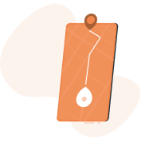
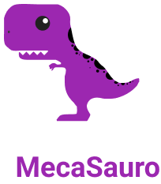

  

  

# Problema

Problemas escolhidos:
 - Manter o distanciamento físico entre as pessoas (comportamento individual, organização física do ambiente e de rotas de deslocamento)
 - Integrar grupos com dificuldades de acompanhar as atividades universitárias presenciais.
# Sobre o projeto

## Objetivo

O projeto visa manter certo distanciamento social nos campi UnB por meio do controle das aglomerações que costumam ocorrer em certos locais de vendas de refeições.

## O que a aplicação faz

A aplicação permite que o usuário (possível cliente) localize vendedores cadastrados no mapa e reserve um local na fila para comprar. Essa fila é virtual, permitindo que o usuário fique em um local longe do vendedor e, assim, evite a aglomeração ao redor do vendedor. Quando for o momento de ser atendido, o usuário recebe uma notificação indicando que pode ir até o vendedor. Nesse meio tempo, o possível cliente pode entrar em contato com o vendedor por meio do Whatsapp para uma melhor comunicação. É possível também selecionar vendedores favoritos, para quando eles ficarem disponíveis, o usuário ser notificado do seu local.

Quanto ao vendedor cadastrado no aplicativo, a aplicação permite que ele insira seu local de venda no mapa a fim de compartilhar com os possíveis clientes. No entanto, caso haja outro vendedor por perto, a escolha da posição só é possível quando feita a partir de uma distância segura. Ao vendedor, também é permitido o controle da fila virtual, para que veja os pedidos e confirme a entrega ou não do produto, como também indicar se está disponível ou não para as vendas.

O protótipo do design para o aplicativo pode ser conferido no [Figma](https://www.figma.com/file/cNvKKiw1dVnuM1DXv2c48l/Prot%C3%B3tipo-Aqui!---MecaSauro), assim como uma [versão animada](https://www.figma.com/file/gjslIK79VqYLD1asqsyBXv/Animado-COVIDAS) da aplicação em si.

# Tecnologias usadas

* [Figma](https://www.figma.com/)
* [React Native](https://reactnative.dev/)
* [TypeScript](hhttps://www.typescriptlang.org/)
* [Expo](https://expo.io/)

# Pitch do Projeto

<strong>O vídeo para o pitch do projeto pode ser visualizado através deste [link](https://youtu.be/IEIK7qH_hys) </strong>

# Documentos

* [Descrição do projeto](https://github.com/COVIDAS-UnB/MecaSauro/blob/master/docs/descricao.pdf)
* [Cronograma de atividades](https://github.com/COVIDAS-UnB/MecaSauro/blob/master/docs/cronograma_atividades.pdf)
* [Cronograma de despesas](https://github.com/COVIDAS-UnB/MecaSauro/blob/master/docs/cronograma_despesas.pdf)

# Equipe

A equipe MecaSauro é formado pelos os seguintes desenvolvedores:
* **André Dornelas** - [adornelas](https://github.com/adornelas)
* **Caio Albuquerque** - [chaioaaD](https://github.com/chaioaaD)
* **Gabriel Bismarck** - [gabrielbismarck](https://github.com/gabrielbismarck)
* **Maria Claudia** - [MariaClaudia1328](https://github.com/MariaClaudia1328)
* **Paulo Henrique** - [paulohenriquerosa](https://github.com/paulohenriquerosa)

 

  

